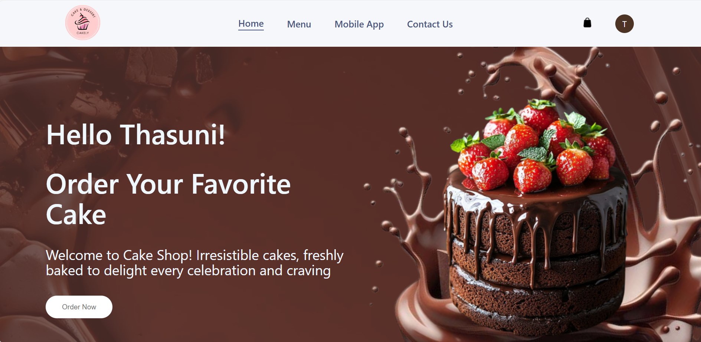

# 🎂 Cakely Frontend – React-Based Cake Ordering Platform
 

---

## 🚀 Project Overview

Welcome to **Cakely!** 🍰 This is the **frontend** of a modern cake ordering platform, offering a smooth and delightful user experience. Customers can browse cakes, register, login, reset passwords, and manage profiles, while admins get dedicated access to manage platform content.

---

## 🛠️ Technologies Used

- **React**
- **React Router DOM** for navigation
- **Axios** for API calls
- **React Toastify** for notifications
- **CSS3 & Flexbox/Grid** for styling and responsive layouts
- **ESLint & Prettier** for code quality and formatting

---

## 📸 Screenshots

## 🖥️ Web View

<table>
  <tr>
    <td style="width: 50%; vertical-align: top; padding: 10px; box-sizing: border-box;">
      <h4>1. Home View</h4>
      
      <p>Responsive home page with featured cakes and navigation.</p>
    </td>
    <td style="width: 50%; vertical-align: top; padding: 10px; box-sizing: border-box;">
      <h4>2. Login Page</h4>
      
      <p>User-friendly login form with validation and error messages.</p>
    </td>
  </tr>
  <tr>
    <td style="width: 50%; vertical-align: top; padding: 10px; box-sizing: border-box;">
      <h4>3. Registration Page</h4>
      
      <p>Simple signup form with email verification flow.</p>
    </td>
    <td style="width: 50%; vertical-align: top; padding: 10px; box-sizing: border-box;">
      <h4>4. Cake Listing</h4>
      
      <p>Browse various cakes with images and prices.</p>
    </td>
  </tr>
  <tr>
    <td style="width: 50%; vertical-align: top; padding: 10px; box-sizing: border-box;">
      <h4>5. Admin View</h4>
      
      <p>Admin dashboard to manage users, cakes, and orders efficiently.</p>
    </td>
    <td style="width: 50%; vertical-align: top; padding: 10px; box-sizing: border-box;">
      <h4>6. Reset Password</h4>
      
      <p>Secure password reset functionality for forgotten credentials.</p>
    </td>
  </tr>
</table>

---

## ⚙️ Setup Instructions

1. Clone the repository  
   ```bash
   git clone https://github.com/yourusername/cakely-frontend.git
   cd cakely-frontend
   ```

2. Install dependencies 
   ```bash
   npm install
   
   ```
   
4. Set Up Environment Variables
   ```bash
   REACT_APP_BACKEND_URL=http://localhost:4000
     
   ```
   
3. Run the development server
   ```bash
   npm run dev
   
   ```

4. Visit on Browser
   ```
   http://localhost:3000
   
   ```

## 👩‍💻 Project Team & Contributions

## 🔗 API & Backend

```bash
http://localhost:8080/swagger-ui/index.html

```

## 📌 Folder Structure (Brief)

```
web_frontend/
├── node_modules
├── public
├── src
│ ├── components
│ ├── context
│ ├── pages
│ ├── CSS
│ │ ├── App.css
│ │ └── index.css
│ ├── App.jsx
│ ├── App.test.js
│ ├── index.js
│ ├── logo.svg
│ ├── reportWebVitals.js 
│ └── setupTests.js
├── .env
├── .gitignore
├── package.json
├── package-lock.json
└── README.md


```

---

## 🔗 Backend Link

- **Backend Repository:** [Cakely Backend](https://github.com/ThasuniInduma/web_backend)

---

### Thank You for Exploring Cakely! 🚀 Happy coding & happy cake craving! 🎂🍰🧁
